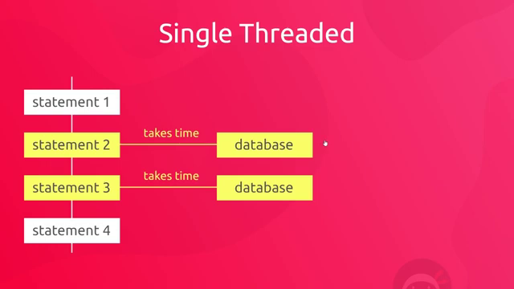
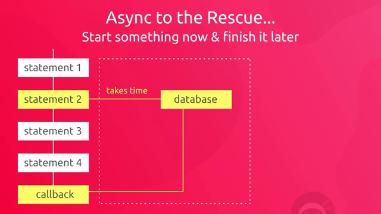

# Async JavaScript

## What is Async JavaScript?

Async governs how we perform tasks which take some time to complete, it is code that can start now and finish later.

JavaScript's nature is to run ONE statement/thread at a time. This nature blocks code because we will need to wait for code that takes longer to execute and block other code below from executing. (see diaram below)




By using Async functions we solve this problem, each statement/thread will be executed normally and the Async thread will be handled seperately and finished later.



Example:
```
console.log(1);
console.log(2);

setTimeout(() => {
    console.log('callback function fired);
}, 2000);

console.log(3);
console.log(4);


//Result: 
//1 
//2 
//3 
//4 
//callback function fired
```

## HTTP Requests
We make HTTP requests to get data from another server, we make these requests to API endpoints. After making requests we get JSON data back for us to use in our browser.

```
Example API endpoint:
https://jsonplaceholder.typicode.com/todos/1
```

## Status Codes
HTTP response status codes indicate whether a specific HTTP request has been successfully completed. Responses are grouped in five classes:

- Informational responses (100–199)
- Successful responses (200–299)
- Redirects (300–399)
- Client errors (400–499)
- Server errors (500–599)

<a href="https://developer.mozilla.org/en-US/docs/Web/HTTP/Status" target="_blank">Read more at Mozilla.org</a>

## Fetch API
The native Fetch API is a faster and more efficient way to write code, it impliments the promise API automatically.

We use the ``fetch()`` to call our Fetch API, the function takes one argument which is the resource we want to fectch or a local resource with a json extension.

When the promise is returned, we use the ``then()`` method callback to take an action if the request was successful and a ``.catch()`` to catch the error.

Note that the fetch API does not detect an error if you mispell the API endpoint, however it can detect an error if there is a problem with the network. Therefore make sure you check your status code in your ``.then()`` callback method.

To get our data we will use the ``.json()`` method on the response object, this will parse the data so that we can use it.

Example:

```
fetch('example/example.json')

.then((response) => {
    console.log('resolved', response);
    return response.json();
})

.then((data) => {
    console.log(data);
})

.catch((err) => {
    console.log('rejected', err);
});
```

## Async & Await
Async & Await are keywords in javascript that allow us to chain promises together in a clean way. 

For example with the code above we can section off all of our Async code in a single function and then use the await keyword inside to chain promises together in a much more logical way.

```
const getTodos = async () => {
   const response = await fetch('examples/example.json'); // Wait for response then set it to response variable.
   if(response.status !== 200) {
       throw new Error('Cannot fetch the data');
   }

   const data = await response.json(); // Wait for data to be changed to json and then set it to the data variable

   return data;
};

getTodos()
    .then(data => console.log('resolved:', data))
    .catch(err => console.log('rejected:', err.message));
```
